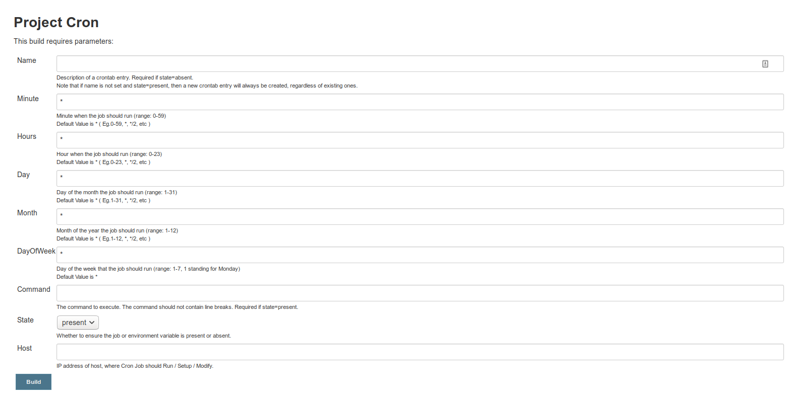

# Cron-Automation




```bash
├── cron
│   ├── roles
│   │   └── common
│   │       └── tasks
│   │           ├── cron.yml
│   │           └── main.yml
│   └── site.yml
```

```bash
cat cron/site.yml 
---
  - hosts: cron
    become: yes
    become_user: root
    gather_facts: no
    roles:
       - common
```
